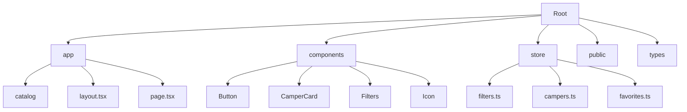

# TravelTrucks — Оренда кемперів в Україні

[English version below](#english-version)

## Опис проєкту

**TravelTrucks** — це сучасний веб-додаток для пошуку та бронювання будинків на колесах (кемперів). Платформа дозволяє користувачам переглядати каталог доступних транспортних засобів, фільтрувати їх за різними параметрами (локація, обладнання, тип кузова), переглядати детальні характеристики, відгуки та бронювати обраний кемпер через зручну форму.

## Технології

Проєкт побудований на сучасному стеку технологій для забезпечення швидкості, масштабованості та відмінного користувацького досвіду:

- **Next.js 16 (App Router)** — основний фреймворк для серверного рендерингу (SSR) та статичної генерації (SSG).
- **TypeScript** — для строгої типізації та зменшення кількості помилок у коді.
- **Zustand** — легкий та швидкий менеджер стану для керування фільтрами та списком обраного.
- **CSS Modules** — для ізольованої стилізації компонентів без конфліктів імен.
- **Formik & Yup** — для обробки форм та валідації даних користувача.
- **Axios** — для виконання HTTP-запитів до API.
- **React Hot Toast** — для відображення стильних сповіщень.
- **Lucide Icons & FontAwesome** — набір сучасних іконок.

## Структура Проєкту



### Опис каталогів:

- `/app` — маршрутизація та сторінки додатку (Next.js App Router).
- `/components` — багаторазові UI-компоненти (кнопки, картки, фільтри тощо).
- `/store` — логіка керування станом додатку (Zustand).
- `/public` — статичні файли: зображення, іконки (SVG sprite).
- `/types` — описи інтерфейсів TypeScript для даних кемперів та фільтрів.
- `/hooks` — кастомні React хуки для повторного використання логіки.

## Як запустити проєкт (Інструкція)

1. **Клонуйте репозиторій:**

    ```bash
    git clone https://github.com/your-username/travel-trucks.git
    cd travel-trucks
    ```

2. **Встановіть залежності:**

    ```bash
    npm install
    ```

3. **Запустіть сервер для розробки:**

    ```bash
    npm run dev
    ```

    Додаток буде доступний за адресою [http://localhost:3000](http://localhost:3000).

4. **Збірка для продакшну:**
    ```bash
    npm run build
    npm start
    ```

---

<a name="english-version"></a>

# TravelTrucks — Camper Rental in Ukraine

## Project Description

**TravelTrucks** is a modern web application for searching and booking campervans. The platform allows users to browse a catalog of available vehicles, filter them by various parameters (location, equipment, body type), view detailed specifications, reviews, and book the selected camper through a user-friendly form.

## Technologies

The project is built on a modern technology stack to ensure speed, scalability, and an excellent user experience:

- **Next.js 16 (App Router)** — The core framework for Server-Side Rendering (SSR) and Static Site Generation (SSG).
- **TypeScript** — For strict typing and reducing code errors.
- **Zustand** — A lightweight and fast state manager for handling filters and favorites.
- **CSS Modules** — For isolated component styling without name conflicts.
- **Formik & Yup** — For form handling and user data validation.
- **Axios** — For making HTTP requests to the API.
- **React Hot Toast** — For displaying stylish notifications.
- **Lucide Icons & FontAwesome** — A set of modern icons.

## Project Structure


### Directory Description:

- `/app` — Routing and application pages (Next.js App Router).
- `/components` — Reusable UI components (buttons, cards, filters, etc.).
- `/store` — Application state management logic (Zustand).
- `/public` — Static files: images, icons (SVG sprite).
- `/types` — TypeScript interface definitions for camper data and filters.
- `/hooks` — Custom React hooks for logic reuse.

## How to Run the Project (Instructions)

1. **Clone the repository:**

    ```bash
    git clone https://github.com/your-username/travel-trucks.git
    cd travel-trucks
    ```

2. **Install dependencies:**

    ```bash
    npm install
    ```

3. **Start the development server:**

    ```bash
    npm run dev
    ```

    The application will be available at [http://localhost:3000](http://localhost:3000).

4. **Build for production:**
    ```bash
    npm run build
    npm start
    ```
