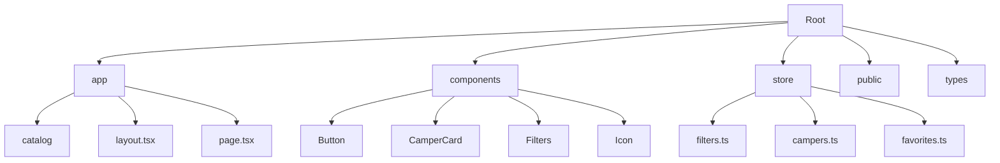

# TravelTrucks — Camper Rental in Ukraine

## Project Description

**TravelTrucks** is a modern web application for searching and booking campervans. The platform allows users to browse a catalog of available vehicles, filter them by various parameters (location, equipment, body type), view detailed specifications, reviews, and book the selected camper through a user-friendly form.

## Technologies

The project is built on a modern technology stack to ensure speed, scalability, and an excellent user experience:

- **Next.js 16 (App Router)** — The core framework for Server-Side Rendering (SSR) and Static Site Generation (SSG).
- **TypeScript** — For strict typing and reducing code errors.
- **Zustand** — A lightweight and fast state manager for handling filters and favorites.
- **CSS Modules** — For isolated component styling without name conflicts.
- **Formik & Yup** — For form handling and user data validation.
- **Axios** — For making HTTP requests to the API.
- **React Hot Toast** — For displaying stylish notifications.

## Project Structure



### Directory Description:

- `/app` — Routing and application pages (Next.js App Router).
- `/components` — Reusable UI components (buttons, cards, filters, etc.).
- `/store` — Application state management logic (Zustand).
- `/public` — Static files: images, icons (SVG sprite).
- `/types` — TypeScript interface definitions for camper data and filters.

## Functional Features

### 1. Search and Filtering

- **Location**: Search for campers by city.
- **Equipment**: Filter by AC, kitchen, TV, bathroom, and transmission type (automatic).
- **Body Type**: Choose between Van, Fully Integrated, and Alcove.
- **Dynamic Updates**: The camper list updates upon clicking "Search". A "No results found" message appears if no matches are found.

### 2. Catalog and Camper Cards

- **Pagination**: "Load More" button to fetch additional campers.
- **Favorites**: Save campers to a favorites list. The state is persisted in `localStorage`.
- **Details**: "Show more" button navigates to the detailed view.

### 3. Camper Details Page

- **Gallery**: View photos with a hover zoom effect.
- **Tabs**: Switch between technical specifications (Features) and user reviews (Reviews).
- **Rating**: Visual star rating based on reviews.

### 4. Booking Form

- **Validation**: Strict validation for name, email, and date using Formik and Yup.
- **Persistence**: Form data is **persisted across page refreshes** using `localStorage`.
- **Notifications**: Success toast notification upon submission, followed by `localStorage` cleanup.

### 5. Responsiveness and Design

- **Responsive Design**: Fully optimized for mobile, tablet, and desktop.
- **Burger Menu**: Mobile-friendly navigation via a slide-out menu.
- **Modern UI**: Smooth transitions, balanced layouts, and premium aesthetics.

## How to Run the Project (Instructions)

1. **Clone the repository:**

    ```bash
    git clone https://github.com/your-username/travel-trucks.git
    cd travel-trucks
    ```

2. **Install dependencies:**

    ```bash
    npm install
    ```

3. **Start the development server:**

    ```bash
    npm run dev
    ```

    The application will be available at [http://localhost:3000](http://localhost:3000).

4. **Build for production:**
    ```bash
    npm run build
    npm start
    ```
